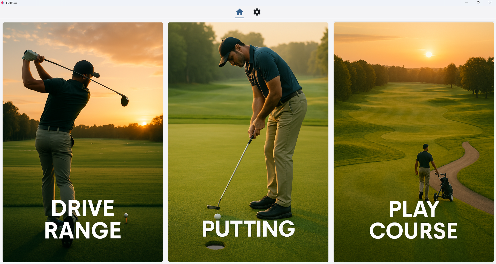

# 🏌️ GolfSim


## 📖 About the Project
**GolfSim** is a golf simulator with shot analysis and statistics visualization.  
The system consists of a **desktop application** and a **mobile client**:

- The mobile app tracks the ball by color and detects the moment of impact.  
- The shot video is transmitted over the local network to the PC.  
- The desktop app analyzes ball speed, launch angle, and calculates distance using [FlightScope Trajectory](https://trajectory.flightscope.com/) (a stub implementation is included; you can integrate your own service or calculations).  
- Shot results are displayed in a sortable and filterable table.  

📱 Mobile app: [GolfSim Mobile](https://github.com/l-Spook-l/golfSim-mobile)  

⚠️ **Important:** The distance between the camera and the ball must be **50 cm** for accurate tracking.  

---

## 🚀 Features
- Ball tracking and impact analysis (launch angles and ball speed).  
- Automatic data transfer between devices via local network.  
- Shot history stored in a table (sorting and filters).  

### 🔜 Upcoming Features (in development)
- Putting mode.  
- Full 18-hole gameplay.  
- Player profile support.  

---

## 🖼️ Screenshots
### Main Menu:  
  

### Driving Range Table:  
  

### Color settings & active profile switch:  
  
  

---

## 📦 Installation & Run
```bash
git clone https://github.com/l-Spook-l/golfsim-core.git
cd golfSim
pip install -r requirements.txt
python main.py
```

---

## Developers
- https://github.com/l-Spook-l

## Contact

If you have any questions or suggestions for improving the project, please contact serhii.mykhailovskyi.ua@gmail.com.
